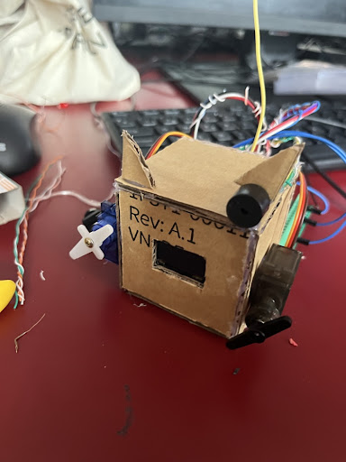

<div align="center">

#  Voice Avatar ESP32 - Diome



*Avatar robótico interactivo controlado por voz y gesticulación en tiempo real.*

---

</div>

##  Breve Explicación del Proyecto
**Draxi** es un avatar robótico interactivo que actúa como puente entre una PC y un microcontrolador ESP32. El sistema permite que el robot reaccione en tiempo real al texto ingresado en la consola de la computadora, sincronizando la emisión de voz hablada desde las bocinas del equipo con animaciones faciales en la pantalla OLED y gestos físicos mediante servomotores.

##  Propósito del Proyecto
El propósito de **Draxi** es ofrecer una interfaz robótica expresiva, didáctica y de bajo costo para proyectos interactivos de la Semana TP. Busca comunicar mensajes mediante síntesis de voz (SAPI5) mientras coordina gesticulaciones físicas en tiempo real (pantalla OLED y servomotores) a través de comunicación por puerto serial a 115200 baudios.

##  Herramientas Ocupadas
### Hardware:
* **ESP32** (Microcontrolador principal)
* **Pantalla OLED SSD1306** (Conexión I2C en pines SDA: G21, SCL: G22)
* **Servomotores PWM** (Conectados en pines G17 y G19 para brazos/orejas)
* **Cable USB a Serie** (Conexión al puerto COM8)
* **Altavoces / Bocinas de la PC**

### Software y Archivos del Repositorio:
* **`cerebro_robot.py`**: Controlador principal en Python que maneja la síntesis de voz nativa (SAPI5) y envía comandos serie al ESP32.
* **`main.ino`**: Firmware C++ para el ESP32 que dibuja expresiones en la pantalla OLED y opera los servomotores.
* **Git & GitHub**: Control de versiones y alojamiento del proyecto.

##  Instrucciones de Uso
1. Cargar el firmware `main.ino` al ESP32 desde Arduino IDE y cerrar el Monitor Serie.
2. Conectar el ESP32 a la PC mediante USB en el puerto `COM8`.
3. Abrir la terminal en la carpeta del proyecto y ejecutar:
   ```powershell
   python cerebro_robot.py
